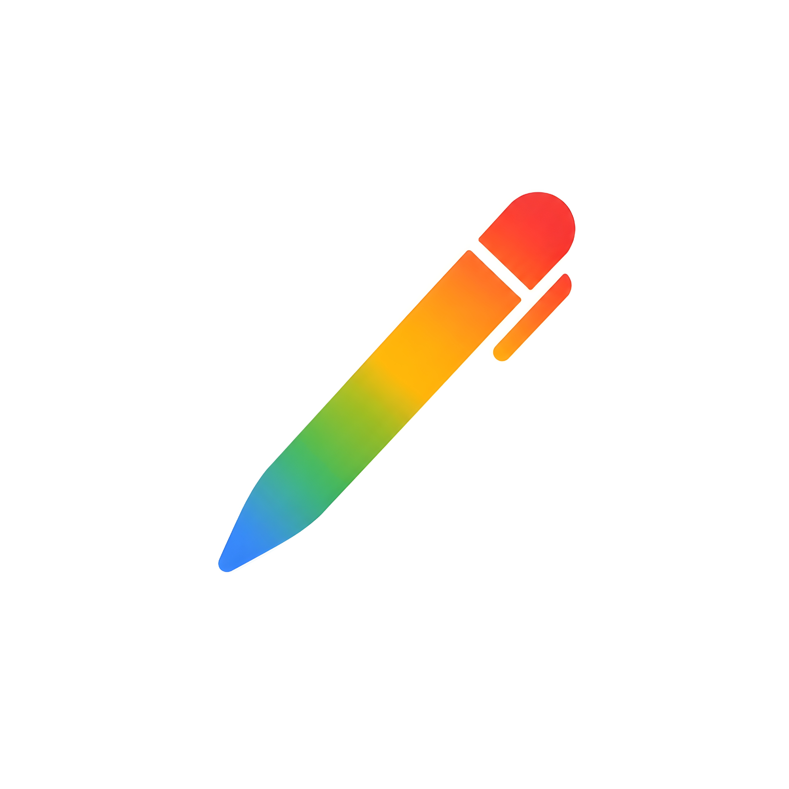

# Doodle Space

<div align="center">
  
  <h3>Doodle Space</h3>
  <p>A modern, cross-platform, infinite-canvas vector whiteboard application built with React, Tailwind CSS, and Capacitor.</p>
</div>

<div align="center">
  
  
  
  
  
</div>

---

## Table of Contents

- [Introduction](#introduction)
- [Key Features](#key-features)
- [Keyboard Shortcuts](#keyboard-shortcuts)
- [Technology Stack](#technology-stack)
- [Project Structure](#project-structure)
- [Getting Started](#getting-started)
- [Mobile Build (Android)](#mobile-build-android)
- [Author](#author)

---

## Introduction

Doodle Space is an interactive infinite vector whiteboard app designed for sketching, brainstorming, diagramming, and keeping layouts aligned. It runs seamlessly on desktop browsers and compiles to native mobile environments (Android/iOS) using Capacitor.

---

## Key Features

- **Infinite Canvas:** Smooth panning and zooming with mouse, trackpad, or touch gestures.
- **Vector Sketching:** Pen and highlighter tools with a 3-point smoothing algorithm to reduce hand-shaking jitter.
- **Shapes & Text:** Draw lines, arrows, rectangles, ellipses, text blocks, and sticky notes.
- **Custom HSL Studio:** Spectrum color picker with fill opacity controls and instant harmonic color recommendations.
- **Workspace Manager:** Search, rename, delete, and backup all canvas sheets to a single JSON file.
- **Multi-platform:** Built for web browsers and native mobile environments (Android/iOS).

---

## Keyboard Shortcuts

| Hotkey | Description |
| :---: | :--- |
| <kbd>V</kbd> | Select/Pointer mode (select, move, or resize elements) |
| <kbd>P</kbd> | Freehand Pen tool |
| <kbd>Y</kbd> | Highlighter tool |
| <kbd>L</kbd> | Line tool |
| <kbd>A</kbd> | Vector Arrow tool |
| <kbd>R</kbd> | Rectangle shape tool |
| <kbd>O</kbd> | Ellipse shape tool |
| <kbd>T</kbd> | Text tool (click anywhere to add text) |
| <kbd>S</kbd> | Sticky Note tool |
| <kbd>E</kbd> | Eraser tool (click or brush over elements to remove them) |
| <kbd>Space</kbd> + **Drag** | Pan across the canvas |
| <kbd>Ctrl</kbd> + <kbd>Z</kbd> | Undo last change |
| <kbd>Ctrl</kbd> + <kbd>Y</kbd> | Redo last change |
| <kbd>Backspace</kbd> / <kbd>Delete</kbd> | Delete currently selected element |

---

## Technology Stack

- **Frontend:** React 19 + TypeScript + Motion (Framer API)
- **Styles:** Tailwind CSS v4
- **Mobile Runtime:** Capacitor 8
- **Icons:** Lucide React

---

## Project Structure

```text
WBoard-App/
├── android/               # Native Android studio project files (Capacitor)
├── assets/                # App icons and media assets
├── src/
│   ├── components/        # Reusable UI component modules
│   │   ├── PageList.tsx          # Sidebar manager for sheets & backups
│   │   ├── Toolbar.tsx           # Canvas actions, stroke weights & HSL color studio
│   │   ├── ProfileModal.tsx      # Configures user profile details
│   │   ├── ShortcutsModal.tsx    # Keyboard shortcut cheat sheets
│   │   └── PermissionModal.tsx   # File system authorization modal
│   ├── App.tsx            # Main state controller, interactive hooks & math solvers
│   ├── types.ts           # Shared TypeScript interfaces & types
│   ├── utils.ts           # Canvas math helpers, vector arrow drawing & compression
│   ├── main.tsx           # React bootstrap element
│   └── index.css          # Tailwind Directives and root global styling rules
├── index.html             # DOM context template
├── package.json           # Scripts and dependency versions
├── vite.config.ts         # Vite bundler configurations
└── capacitor.config.ts    # Capacitor native app configuration settings
```

---

## Getting Started

### Prerequisites
Make sure you have Node.js installed on your machine.

### 1. Install Dependencies
```bash
npm install
```

### 2. Run Locally (Web)
```bash
npm run dev
```

### 3. Build for Production
```bash
npm run build
```

---

## Mobile Build (Android)

Capacitor configures native builds under the application ID `com.doodle.space`.

1. Compile the web assets and sync:
   ```bash
   npm run build
   npx cap sync
   ```
2. Launch the project in Android Studio:
   ```bash
   npx cap open android
   ```
3. Run or export the APK directly from Android Studio.

---

## Author

**Nithish**
- **GitHub:** [@NITHIZ-M](https://github.com/NITHIZ-M)
- **Contact:** nithish1436m@gmail.com
